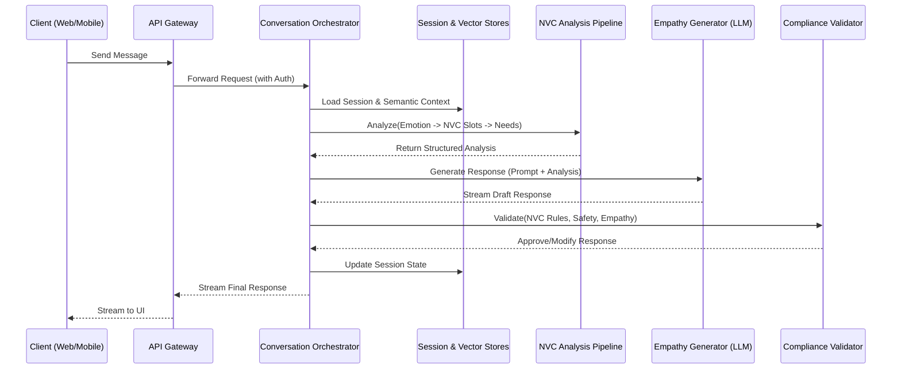
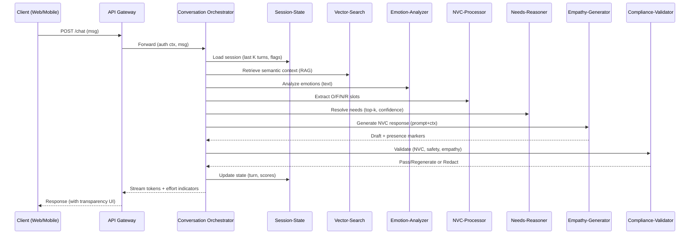

# NVC_AI


## **Implementation Plan: Nonviolent Communication (NVC) Embedded AI**

### **1. Executive Summary & Project Goals**

This document outlines the complete architectural blueprint and implementation plan for an AI system embedded with the principles of Nonviolent Communication (NVC).

*   **Primary Goal:** To create an AI-powered coach that helps users communicate more effectively and empathically by analyzing their input and suggesting responses aligned with the NVC framework (Observations, Feelings, Needs, Requests).
*   **Initial Approach:** A **text-first** implementation (MVP) with clear, structured growth paths toward multimodal (voice, video) and enterprise-grade features.
*   **Core Architecture:** A containerized, cloud-agnostic microservices architecture organized within a single monorepo for streamlined development and deployment.
*   **Key Feature:** A **local-first deployment option** is a primary consideration, ensuring privacy, air-gapped operation, and independence from third-party cloud LLM providers.

### **2. Core Architectural Principles**

*   **Microservices:** Each component has a single, well-defined responsibility, enabling independent development, scaling, and maintenance.
*   **Contracts-First Design:** Service interactions are defined by gRPC/Protobuf contracts, allowing for type-safe client generation and preventing integration drift.
*   **Stateless Services:** Core logic services are stateless, with all conversational and user state managed externally in dedicated stores (Redis, Postgres, Vector DB).
*   **Centralized Telemetry:** All services emit structured logs, metrics, and traces (OpenTelemetry) to a central collector for comprehensive observability.
*   **Privacy & Safety by Design:** The system incorporates PII scrubbing, content filtering, and data minimization as core features, not afterthoughts.

### **3. System Architecture Overview**

#### **High-Level Data Flow (Per User Turn)**

The system processes user input through a sequential pipeline orchestrated by the `conversation-orchestrator`.



#### **Monorepo Folder Structure**

The entire project is housed in a single repository to simplify dependency management and cross-service development.

```plaintext
nvc-ai/
├─ apps/              # User-facing applications (UI, Admin)
├─ services/          # Backend microservices (core logic)
├─ serving/           # Local LLM and ML model serving configurations
├─ data/              # Datasets and data versioning manifests
├─ models/            # Trained model checkpoints and registries
├─ pipelines/         # MLOps pipelines (data ingestion, training, deployment)
├─ infra/             # Infrastructure-as-Code (Kubernetes, Docker, Terraform)
├─ libs/              # Shared libraries (NVC taxonomy, Protobuf, clients)
├─ tests/             # End-to-end, integration, and contract tests
├─ docs/              # System architecture, API contracts, runbooks
├─ scripts/           # Utility scripts (model download, quantization)
├─ .env.example       # Template for environment variables
└─ Makefile           # Shortcuts for common development tasks
```

### **4. Component Breakdown & Responsibilities**

#### **`apps/` - User-Facing Applications**

*   **`web-client`**: The primary user interface. A Next.js application featuring the chat interface, coaching flows, and transparency indicators (e.g., showing AI "effort").
*   **`admin-console`**: A control panel for operators to manage datasets, review model evaluations, configure feature flags, and manage prompt templates.

#### **`services/` - Core Backend Microservices**

*   **`api-gateway`**: Single public entry point. Handles authentication (OIDC/JWT), rate limiting, request validation, and WebSocket connections for streaming responses.
*   **`conversation-orchestrator`**: The "brain" of the system. It receives requests from the gateway and routes them through the entire NVC pipeline in the correct order.
*   **`llm-router` (for Local-First)**: An intelligent proxy that directs generation requests to the appropriate local LLM backend (vLLM, Ollama) based on health, capacity, and policy. It presents a unified, OpenAI-compatible API to the orchestrator.
*   **`emotion-analyzer`**: A small, fine-tuned transformer model (e.g., BERT) that classifies emotions from text. Designed to be extensible for voice and video modalities.
*   **`nvc-processor`**: Extracts the four core NVC components (Observations, Feelings, Needs, Requests) from text. Also identifies and rewrites judgmental language.
*   **`needs-reasoner`**: Maps identified feelings to a canonical list of universal human needs using the `nvc-taxonomy`. It can resolve conflicting needs and provide rationales.
*   **`empathy-generator`**: Wraps the Large Language Model. It assembles the final prompt using context, NVC analysis, and versioned templates, then streams the generated response.
*   **`compliance-validator`**: Acts as a final quality gate. It scores the generated response for NVC compliance, empathy, and safety. It can reject a response and trigger regeneration if it fails to meet quality standards.
*   **`session-state`**: Manages conversational memory. Uses Redis for hot, short-term storage (last K turns) and Postgres for long-term, cold storage.
*   **`vector-search`**: Manages semantic memory. It embeds conversational turns and stores them in a vector database (e.g., Qdrant) to support Retrieval-Augmented Generation (RAG).
*   **`prompt-service`**: A version-controlled repository for all system prompts and templates. Supports A/B testing and provides an audit trail for prompt changes.
*   **`content-filter`**: A safety service that scans both user input and AI output for toxicity, self-harm risks, and PII leaks.
*   **`eval-service`**: Runs offline and online evaluations of model performance, tracking metrics for empathy, NVC slot coverage, and user satisfaction.
*   **`telemetry`**: A collector for OpenTelemetry data, scrubbing PII before exporting to monitoring platforms.

#### **`libs/` - Shared Libraries**

*   **`nvc-taxonomy`**: A canonical, versioned JSON library defining the ontology of feelings and needs, used consistently across all relevant services.
*   **`proto`**: Protobuf definitions for all gRPC-based service-to-service communication.
*   **`clients`**: Auto-generated, type-safe client SDKs (Python, TypeScript) for interacting with the microservices.

### **5. API Contracts (Examples)**

Services will communicate via gRPC using contracts defined in `libs/proto`. REST is used only at the edge (`api-gateway`).

```python
# libs/proto/nvc_processor.proto
message NVCProcessRequest {
  string text = 1;
}
message NVCProcessResponse {
  string observation = 1;
  repeated string feelings = 2;
  repeated string needs = 3;
  repeated string requests = 4;
  repeated string judgments = 5;
  string rewrite_nonjudgmental = 6;
}

# libs/proto/compliance_validator.proto
message ValidateRequest {
  string response_text = 1;
  // ... other context
}
message ValidateResponse {
  bool is_ok = 1;
  float empathy_score = 2;
  repeated string violations = 3;
}
```

### **6. State Management**

| State Type | Primary Store | Owning Service | Description |
| :--- | :--- | :--- | :--- |
| **Session State** | Redis (Hot), Postgres (Cold) | `session-state` | Ephemeral turn-by-turn context with TTL; archived nightly. |
| **Semantic Memory** | Vector DB (Qdrant, PGVector) | `vector-search` | User-namespaced embeddings for RAG and long-term reflection. |
| **User Preferences** | Postgres | `personalization` | User goals, consent flags, learning pace. Minimal PII. |
| **Models & Prompts**| S3/Blob Store + MLflow, Git | `models/*`, `prompt-service` | Immutable, versioned artifacts with clear promotion paths. |
| **Telemetry Data** | Prometheus, Loki/ClickHouse | `telemetry` | PII-scrubbed metrics, logs, and traces. |

### **7. Deployment Strategy & Infrastructure**

This architecture supports two primary deployment targets.

#### **A. Cloud-Agnostic (Default)**

*   **Orchestration**: Kubernetes (Helm charts in `infra/k8s/`).
*   **Infrastructure**: Terraform (`infra/terraform/`) to provision managed resources like VPCs, databases (Postgres/Redis), and object storage (S3).
*   **Networking**: Service mesh (Istio/Envoy) for mTLS, traffic management, and policy enforcement.
*   **CI/CD**: `pipelines/deployment` defines a CI/CD process for blue/green service updates and canary/shadow model deployments.

#### **B. Local-First / On-Premise Variant**

This variant replaces cloud dependencies with locally-hosted components, orchestrated via Docker Compose for single-node setups or Kubernetes for on-prem clusters.

*   **LLM Serving**: Uses `serving/` configurations.
    *   **`vLLM` (Primary/GPU)**: For high-throughput production inference.
    *   **`Ollama` / `llama.cpp` (Fallback/CPU/GPU)**: For development, easy setup, and lower-resource environments.
*   **Key Service**: The **`llm-router`** service is activated to abstract the local LLM providers, enforce privacy policies (e.g., prevent cloud failover), and manage fallbacks.
*   **Local Stack (`infra/local/docker-compose.yml`)**: A `docker-compose` file will define and link all necessary services: `postgres`, `redis`, `qdrant`, `vllm`, `ollama`, and the core application services.
*   **Data Flow**: The data flow remains identical, but the `empathy-generator`'s call to an LLM is routed through the `llm-router` to a local model server instead of a cloud API.

### **8. Evaluation Strategy**

*   **Static Metrics**: BERTScore, BLEURT, ROUGE for fluency; custom metrics for NVC Slot Coverage and politeness.
*   **Empathy Metrics**: Human ratings on a Likert scale; `Empathy@k` (does the model identify one of the user's top-k needs?); rate of user corrections.
*   **"Empathy Fog" Indicators**: Metrics designed to measure over-reliance or misunderstanding, such as the delta between user-reported effort and system-displayed assistance.
*   **Online Metrics**: Conversation success rate, user retention, CTR on suggested clarifications, and task completion.

### **9. Implementation Roadmap (MVP → V1)**

1.  **Phase 1: Core Service Foundation**
    *   [ ] Set up the monorepo structure with initial CI/CD pipelines.
    *   [ ] Stand up `api-gateway`, `conversation-orchestrator`, and `session-state` (using Redis).
    *   [ ] Develop the `nvc-taxonomy` in the `libs/` folder.
    *   [ ] Implement the `nvc-processor` to extract O/F/N/R slots based on rules and keyword matching.

2.  **Phase 2: ML Model Integration (Local-First)**
    *   [ ] Ingest and process the EMPATHETICDIALOGUES dataset.
    *   [ ] Fine-tune a small BERT-based model for the `emotion-analyzer`.
    *   [ ] Set up the `serving/vllm` and `serving/ollama` containers with a pre-trained instruction-following LLM (e.g., Llama 3 8B Instruct).
    *   [ ] Implement the `llm-router` and `empathy-generator` services.
    *   [ ] Create initial NVC prompt templates in `prompt-service`.

3.  **Phase 3: Assembling the Pipeline**
    *   [ ] Wire all services together through the `conversation-orchestrator`.
    *   [ ] Implement the `compliance-validator` with basic NVC rules (e.g., no "you" statements, must contain a feeling/need).
    *   [ ] Build a basic `web-client` to interact with the full pipeline.

4.  **Phase 4: Memory and Evaluation**
    *   [ ] Integrate `vector-search` (Qdrant) to provide short-term semantic memory (RAG).
    *   [ ] Stand up the `eval-service` and log initial offline empathy and NVC coverage metrics.
    *   [ ] Implement basic telemetry and logging across all services.

5.  **Phase 5: Hardening and V1 Launch**
    *   [ ] Harden the `content-filter` for safety.
    *   [ ] Implement user deletion endpoints and ensure data minimization policies (TTL) are active.
    *   [ ] Add transparency features to the UI (e.g., "I'm thinking...", "Here's how I understood your need...").
    *   [ ] Conduct red-teaming and refine prompts and validation rules.
    *   [ ] Document runbooks for local and cloud deployment.



